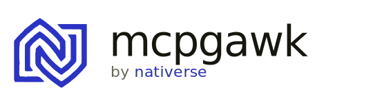
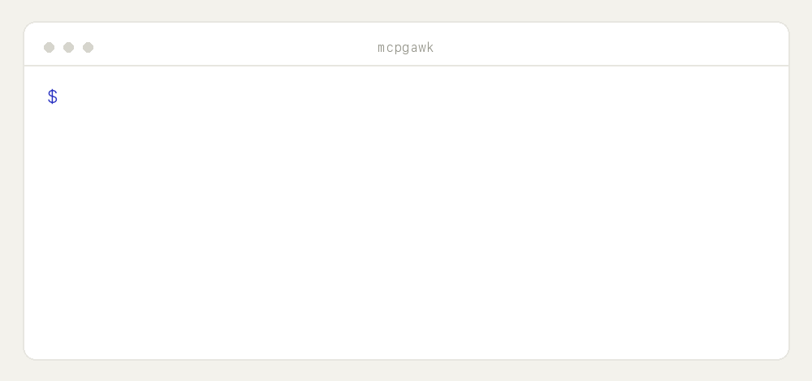

<p align="center">
  <picture>
    <source media="(prefers-color-scheme: dark)" srcset="assets/brand/wordmark-dark.svg">
    
  </picture>
</p>
<p align="center"><em>gawk at it before you trust it.</em></p>

# mcpgawk

[](https://pypi.org/project/mcpgawk/)
[](https://pypi.org/project/mcpgawk/)
[](LICENSE)
[](tests)
[](#guarantees)

**gawk at an MCP server before you trust it.** A single, local-first command that connects to any
[Model Context Protocol](https://modelcontextprotocol.io) server and measures what it will cost and
expose — **without the server's inventory ever leaving your machine.**

<p align="center">
  
</p>
<p align="center"><sub>Real output. Reproducible on your machine — no account, nothing uploaded.</sub></p>

## Why

Every MCP server you connect dumps *all* its tool definitions into your model's context at connect
time — whether you use one tool or none. That's a hidden **token tax** and an unvetted **trust
surface**. mcpgawk measures both, **locally**, and never phones home about what it saw.

## How it's different

- **vs. cloud scanners** (e.g. Snyk/Invariant `mcp-scan`) — they upload your inventory to a server and
  gate the verdict. mcpgawk runs entirely on your machine; nothing is uploaded, ever.
- **vs. lazy-load gateways** — they cut tokens but tell you nothing about the *risk* surface.
- **mcpgawk does both** — cost **and** trust — locally, reproducibly, in one command.

## Features

- 🔌 **Any transport** — stdio, streamable-HTTP, SSE, and OAuth remotes (via the `mcp-remote` bridge).
- 💸 **Token cost index** — exactly what each tool adds to your context at connect.
- 🧾 **Capability facts** — write / exfil-capable / declared annotations, straight from the schema.
- 📌 **Integrity pin + drift** — catch a server that silently rewrites its tools (`--track`).
- 🚩 **Bounded signals** — injection-shaped descriptions, cross-server shadowing, under-declaring Server Cards — pointers for a human, never verdicts.
- 🔒 **Zero egress, by construction** — the measurement layers import no network library. Enforced by a test.

## Install

```bash
pip install mcpgawk        # or: uv tool install mcpgawk
```

## Use

```bash
mcpgawk scan mcp.json                                              # a whole config
mcpgawk scan --stdio "npx -y @modelcontextprotocol/server-filesystem /tmp"
mcpgawk scan --http https://host/mcp --header "Authorization: Bearer $TOKEN"
mcpgawk scan --sse  https://host/sse
mcpgawk scan mcp.json --track                                     # record + detect rug-pulls over time
mcpgawk scan mcp.json --json                                      # machine-readable labels
```

## What it reports

- **Cost index** — tokens each tool adds at connect (named tokenizer; a comparable index, not an
  absolute Claude count).
- **Capability facts** — write/mutating, exfil-capable, declared annotations.
- **Integrity pin** — a hash that changes if the server silently rewrites its tools; `--track`
  turns it into rug-pull detection over time.
- **Bounded signals** — precise, low-false-positive pointers *for a human to review*, never verdicts:
  injection-shaped descriptions (tools **and** prompts), cross-server name shadowing, and public
  Server Cards that under-declare what the server actually exposes.

## Guarantees

- **No inventory egress.** The only network is the protocol client talking to the server you point
  it at. The measurement layers import no network library — they *cannot* egress by construction
  (enforced by a test). Public Server Card discovery is fetched with no auth and no redirect-following.
- **Facts ≠ heuristics.** Exact capability facts and the token index never mix with the bounded
  heuristic signals — separate in code, separate in output.
- **Reproducible.** One command, identical numbers.
- **Rides protocol evolution.** Built on the official `mcp` SDK, which negotiates the protocol version.

## Develop

```bash
uv run --extra dev --with mcp --with tiktoken --with httpx python -m pytest -q
```

## Contributing

Issues and PRs welcome. Please read [CONTRIBUTING.md](CONTRIBUTING.md) first, and see the design
boundaries in [THREAT-MODEL.md](THREAT-MODEL.md). Security reports go through [SECURITY.md](SECURITY.md)
(privately, not a public issue).

## License

**Apache-2.0** — see [LICENSE](LICENSE). Part of the **nativerse** · gawk.dev family. The value is in the
repo, not a cloud.
